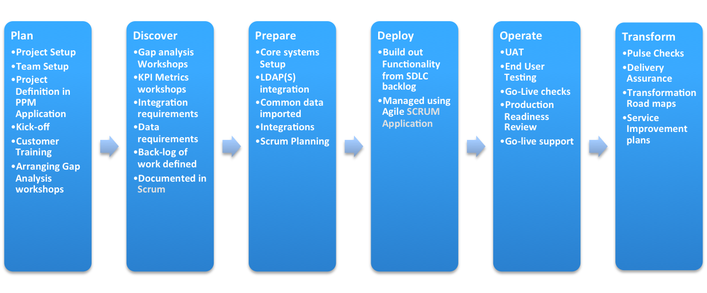

test
# Implementation Bootcamp

--- 

## StartNow

+++

### START

Strategic Alignment and Rapid Transformation

+++ 

## Licença StartNow

**Requer uma licença adicional**. Se não comprar, o acesso é apenas durante
implantação + 30 dias após o Go-Live. Depois do prazo os registros vão travar
apenas read-only.

+++

### SAIF

- Disponível com a licença do PPM |

---

*Plan* -> *Discovery* -> *Prepare* -> *Deploy* -> *Operate* -> *Transform*

+++

+++

**Plan**
- Kickoff
- Explicar ao cliente de acordo com o que foi acordado no contrato
- Começa a planear o projeto.

+++

**Discover**
- Mapeamento dos requerimentos como stories.

+++

**Prepare**
- Preparar o setup da instância, preparação do projeto
- LDAP(s) integration
- Common Data
- Scrum planning para as releases e sprints
- Security e Compliance

+++

**Deploy**
- Começa a implantar de fato o que foi mapeado
- Construir a funcionalidade definida no Scrum
- Project management
- Sprint planning, stand up reviews
- ACE report reviews

+++

**Operate**
- Testar o que foi feito, checklist
- Acceptance testing
- US Validation
- GO-Live

--- 

## O Que contêm

- Plugin Agile Development (SCRUM)
- Project Plan Templates |
- RIDAC (Risks, Issues, Decisions, Actions, Changes) |

+++

#### Como são organizadas as histórias

+++

### Product -> Release -> Sprint -> (Epic) -> Stories

**Exemplo**: Cliente quer ITSM, CMDB, RH.
- O que podemos fazer são workshops para incidentes, problemas, mudanças e isso fazem parte dos requerimentos de um produto (ITSM) |
- Uma release para incidente, problema, mudança, catálogo de serviço. |

+++

### RIDAC

Risk Issues Decisions Actions Changes

+++

Risk 

- Podem ou não acontecer
- Impacto no escopo

+++

Issue

- Já aconteceu ou está acontecendo
- Identificar a correção

+++

### Scrum

Create and PPM -> Requirements Workshop Output (stories) -> Organize Sprint -> Scrum Activities
-> Ready for testing and Go-Live

+++ 

**Project Management**
- Engagement Manager
- Customer Product Manager

+++

**Scrum**
- Engagement Manager
- Technical Consultant
- Customer Process Owner
- Customer Product Owner

+++

**Risk**
- Engagement Manager
- Technical Consultant
- Some Customers

---

## Plan Stage Guidelines

- Setup do time
- Onde treinar os sysadmins
- Abordar gerenciamento de instâncias
- Configurar o StartNow.
- Como fazer reunião de kickoff

+++

### Atividades no Plan Stage

- Configurar o StartNow
- Setup release teams definir as equipes de implantação |
- Plano de projeto |
- Pré propular RIDAC |

+++

**DEPOIS DO KICKOFF**

- Review do plano de projeto
- Review do plano de treinamento |
- Review Onboarding plans |
- Muito importante obter compromisso do cliente para o projeto. Um cliente que |
  Não ajude durante a implantação é muito complicado

---

### Quem pertence às equipes

+++

#### Da parte do Parceiro implementador

- Engagement Manager / Scrum Master
- Business Process Consultant (BPC) |
- Technical Consultant |
- Integration Consultant |
- Specialists |

+++

#### Da parte do cliente

- Project Manager
- Executive Sponsor
- Sysadmins
- Platform Owner
- Quality Assurance
- Product Owner e Process Owner

+++

Dependendo do contrato o cliente tem pelo menos 2 vagas gratuitas em
treinamentos.

No [servicenow.com/training](http://servicenow.com/training) é possível ver os treinamentos e certificações
disponíves.

--- 

#### Maneiras adicionais de engajamento
- Community user groups
- Product docs |
- Developer Site |
- Partner Portal |
- ServiceNow training |
- Social Media |
- Youtube Channel |
- Servicenow Share |
- Application Showcase |
- Champions Community |

+++

#### Instance Provisioning

Dependendo da licença vai se ter 2 ou 3 instâncias.

+++

#### Clones

Pode ser feito direto de prod para dev ou do *backup* de prod para dev.

+++

#### Update Set

Um update set é um grupo de customizações que pode ser movido de uma instância
para outra.

---

**Develop Solution** -> **Test Solution** -> **Go-Live**

+++

##### Primeira Estratégia - Menos que Ideal

1. Clonar Dev para Teste
2. Clonar Test para Prod 
3. Clonar Prod de volta para Dev e Test para sincronizar as instâncias

+++

##### Segunda Estratégia - Um pouco mais Ideal

1. Desenvolver em Prod antes do Go-Live
2. Após clonar para Dev e Test

+++

##### Terceira Estratégia - Via US - Ideal

- Começar a desenvolver em dev com Update Sets e move-los individualmente |
- Utilizar o módulo de stories e numerar os cards para fazer o update set |
- Testes devem ser feitos em QA |

+++

### StartNow Implementation Group - Local

Módulo StartNowGroup para adicionar todas as pessoas que **vão** trabalhar na
implementação. O grupo garante a role necessária para ter acesso à StartNow.

+++

#### Formulário da release
- Acesso aos produtos inclusos na release
- Sprints inclusos na release
- Stories inclusos na release
- Equipes incluido na release

---

### Prepare and Run Kickoff Meeting

Declaração clara e objetiva das expectativas e suposições.

+++

#### O que deve ser mencionado ?

- Vender a empresa e objetivos |
- Apresentar a filosofia da empresa sucintamente |
- Falar sobre metodologia StartNow |
- Rever como  o projeto será gerenciado |
- Importante que o cliente se apresente |

---

## Sprints

+++

### Story Point Estimation

+++

- Estimar apenas quando o usuário fornecer todas informações necessarías
- Contingências: Variação de skill level |
- Fase de testes |
- Configuração da estória |
- Tempo para fazer pesquisa |
- Tempo para rever a estória |

+++

#### Team Commitment

Quantidades de pontos que o time vai conseguir entregar. Montar a sprint
com estórias que somem esse número.

--- 

## Initial Configuration

+++

### Guided Setups

Wizard passo a passos com o setup

+++

- Branding da instância
- Timezone |
- Formato da data |
- Email properties |
- LDAP Integration: alguns plugins são necessários |
- SSO Integration |

+++

### Importar Dados do Cliente

Todas implementações vão requerer dados externos do clientes

+++

#### Before importing any data

+++

- Entender os dados que você está trazendo e onde eles devem ser colocados
- Determinar as dependências e definir o coalesce |
- Corrigir dados incorretos |
- Perceber que nem todos dados disponíveis devem ser importados |

+++

### LDAP

+++

- Domínio
- Credenciais |
- Campo de leitura |
- SNow nunca escreve no LDAP |

---

## Deploy

+++

Trabalhar o backlog em uma série de Sprints menores para construir um Product
Release Candidate.

+++

### Meetings

- Planeamento da Sprint
- Diariamente as Stand up Meetings |
- ACE/Sprint Review |
- Retrospective |

+++

Planning Meeting -> Knowledge Transfer -> Ace / Sprint Review -> Sprint Review
& Retrospective

---

### Best Practices

+++

Reports
- Em grande número na home page podem afetar muito a performance

+++

Loading Data
- Abrimos um registro, os dados devem ser carregados
- Muitos dot walkings vão afetar a performance |

+++

Related Lists
- Quanto mais pior a performance
- Pode-se definir em que momento elas serão carregadas para melhor contornar
  o tempo de carregamento |

+++

Form Fields
- Avois Unecessary Fields
- Reference field that can be viewed from the reference icon should not be
  added to the current form
- Instead of hiding fields on a form for a certain groups of users, determine
  if a separate view can be used instead
- Avoid, where possible, adding fields that require a dot-walk to another table 

+++

##### Grandes responsáveis pela performance

Client Scripts
Business Rules

+++

**Avoid Open-Ended Queries**

Query by `addQuery` or `addEncodedQuery` instead of nesting `if` statements

+++

##### Limit Client side code execution

- For performance reasons it is best to limit the amount of code executed on the
client
- When possible use UI Policies to only set a field to mandatory |
- Control visibility and read-only of a field bby using ACLS which execute server side unless rules are dependant on client side activities |
 

+++

- Restrict which users may customize homepages
- Use dashboards
- Schedule large reports to run outside buss hours
